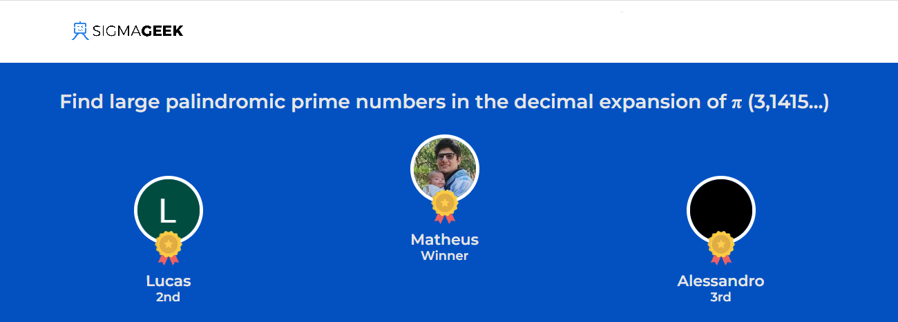

# SigmaGeek Prime Palindrome Challenge

SigmaGeek's Prime Palindrome Challenge was a quest to find large palindromic prime numbers in the decimal expansion of π (3.1415…). Taking place between July and September of 2022, the event featured a $2,000 prize for the winner and consisted of three phases:
  

* **What is the first 9-digit palindromic prime found in the decimal expansion of Pi?** (1023 competitors passed this phase)
* **What is the first 21-digit palindromic prime found in the decimal expansion of Pi?** (152 competitors passed this phase)
* **What is the largest palindromic prime found in the decimal expansion of Pi?** (26 competitors passed this phase)
  

With the competition ending in a tie, a final phase was held:
  

* **What is the next number in the sequence?**
 

> 961212169  
> 102454201  
> 337515733  
> 347676743

 
After two hours, four correct answers were submitted, marking the end of the challenge.  

## My experience

I found this challenge when I just started learning programming. Having studied Python for just about a month, I saw this as a massive opportunity to learn further and put my skills to the test. I was new to the tech world and had no prior knowledge of cloud computing, virtual machines, Linux, and other aspects needed to tackle the challenge. However, as I progressed through the competition's levels, I acquired many new skills.

Solving this problem required me to dedicate a significant amount of time and effort into this task. So, when I managed to finish the challenge in first place, I felt truly happy. However, this doesn't mean my solution was the best for the first three phases of the problem. As only the answer was checked and not the code, any solution that found the correct number would pass. In reality, my approach to the problem was quite naive. Although it worked, it consumed a lot of resources. Many other experienced competitors used better practices and completed the task in far less time and with less computational cost.

Upon the challenge's conclusion, I took immense pride in my achievement. Even so, I decided not to post my solution until I had learned C++ and more about cloud services, aiming to present an optimized solution. Now, in July 2023, I've changed my mind. I'm publishing my original solution to the problem in this repository, aware of its many flaws, knowing that it required hundreds of virtual machines to complete in days what could have been done in hours. But it was the best I could do with the time and knowledge I had then. Besides, it will serve as a record of my early days in the tech field, so one day I can look back and see how much I've improved.
  

## My solution

>setup.py

setup.py is a Python script that establishes multiple directories and generates associated bash scripts for each directory. These bash scripts perform tasks such as system updates, package installations, and the execution of a specific Python script for analyzing chunks of Pi's decimal expansion.
  

> find_prime_palindrome.py

find_prime_palindrome.py is a Python script that reads a text file containing the digits of Pi, identifies sequences of digits that are palindromes, checks if these palindromes are prime numbers, and records any prime palindromes found into a separate text file.
  

> gcloud_setup.py

gcloud_setup.py is a Python script that automates the configuration, deployment, and data transfer processes for multiple virtual machines in Google Cloud Platform, making it easier to manage and interact with the cloud resources.
  

## Acknowledgments

* Thanks to SigmaGeek team for organizing a great challenge
* Thanks to my wife, Laura, for her support during the event.
